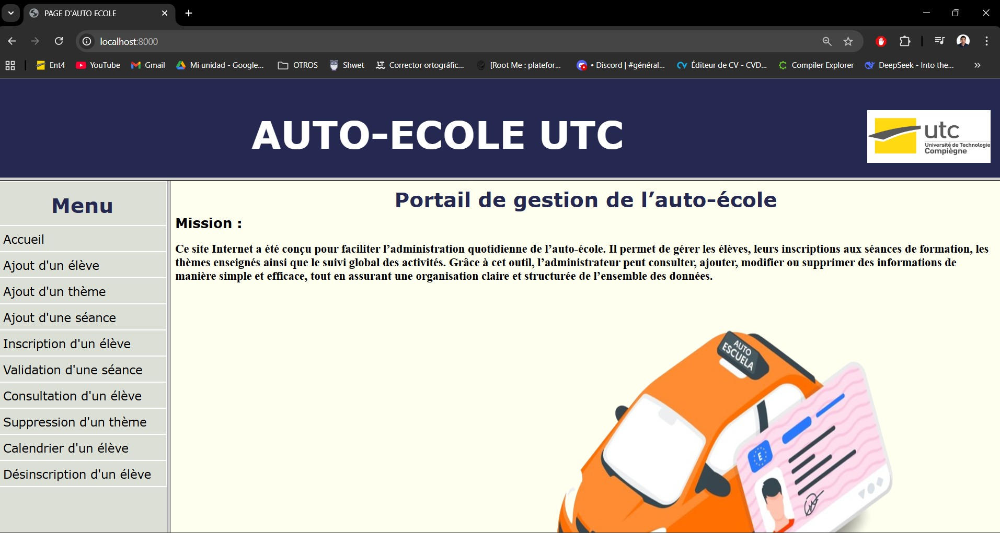

# Gestion d'une Auto-École — Projet PHP (UTC)

Projet réalisé dans le cadre d’un travail universitaire (NF92) visant à apprendre les bases du développement web dynamique avec **PHP** et **PostgreSQL**.

Ce site permet de gérer les élèves, les thèmes, les séances, les inscriptions et les notes d'une auto-école.  
Il s’agit de mon premier projet complet orienté **back-end**, avec une véritable interaction entre un front simple en HTML/CSS et une base de données relationnelle.


## 🎯 Objectifs du projet

- Apprendre à connecter des pages **HTML** à du code serveur en **PHP**.
- Manipuler une base de données PostgreSQL via des requêtes SQL.
- Comprendre le fonctionnement d’un CRUD complet (Create, Read, Update, Delete).
- Gérer des formulaires, validations et affichage dynamique de données.
- Construire un site entièrement fonctionnel sans frameworks.

---

## 📚 Fonctionnalités principales

### ✔ Gestion des élèves
- Ajout d’un élève  
- Consultation du dossier (notes, séances passées, infos)
- Visualisation du calendrier (séances futures)
- Inscriptions / désinscriptions

### ✔ Gestion des thèmes et séances
- Création de thèmes
- Création de séances associées à un thème
- Capacité maximale par séance
- Liste des séances disponibles

### ✔ Notation
- Saisie et modification des notes sur 40
- Affichage dans le dossier de l’élève

---


## 🖼 Captures d’écran

| Accueil | Consultation élève |
|--------|---------------------|
|  |  |

| Ajout séance | Calendrier |
|--------------|------------|
|  |  |


## 🛠 Technologies

- **PHP 8**
- **HTML / CSS**
- **PostgreSQL**
- Hébergement local via `php -S localhost:8000`
- **Serveur local : PHP built-in server / localhost:8000**

## 🚀 Installation

1. Cloner le dépôt :
```bash
git clone https://github.com/russellrojas/autoecole-php.git
cd autoecole-php
```

## 📌 Remarque

Ce projet a été réalisé dans le cadre universitaire en 2023 et est actuellement mis à jour et adapté pour GitHub en 2025 à des fins de portfolio.

## 📝 Auteur

Projet universitaire réalisé par Russell Rojas.

